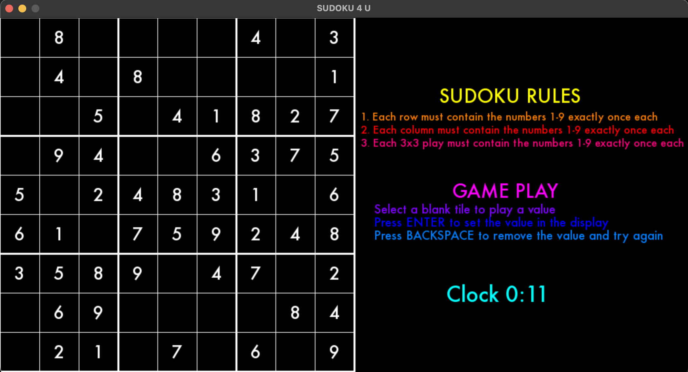
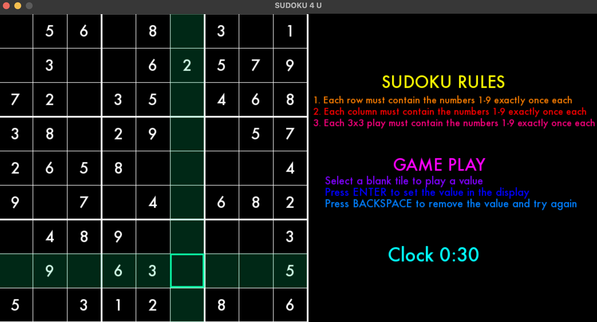
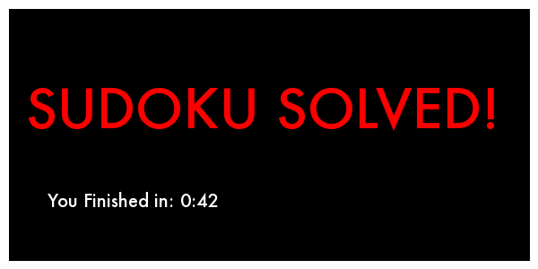

## P01 - Sudoku 4 U
### Leslie Cook
### Description:

- This is a classic sudoku game created using pygame. The user is shown the rules of the game and how to play. The game has a timer to track how long it takes to solve the puzzle. A notification sound is played if the user has entered a correct or incorrect answer. When the sudoku is solved, the user is shown the amoung of time it took for them to solve the puzzle and the game automatically resets after 10 seconds. 

### Files

|   #   | File            | Description                                           |
| :---: | --------------- | ------------------------------------------------------|
|   1   | Grid.py         | The class that generates the values for the 9x9 grid. |
|   2   | main.py         | The main driver that handles all pygame logic.        |
|   3   | Play.py         | The class that handles the interactive game elements. |
|   4   | requirements.txt| The file to load all requirements to run the game.    |
|   5   | Tile.py         | The class for the properties of each tile in the grid.|
|   6   | utilitles.py    | Additional methods for game properites.               |
|   7   | fonts           | Folder the fonts used in the game.                    |
|   8   | music           | Folder with muisic and sounnd bytes used in the game. |
|   9   | screenshots     | Folder with the tiled .tmx levels used in the game.   |

### Instructions

- Make sure you install the requirements.txt before running the game.
    - `pip install -r requirements.txt`
    - `pip3 install -r requirements.txt`

- Example Command to Launch the Game:
    - `python main.py`
    - `python3 main.py`

### Screen Shots:

