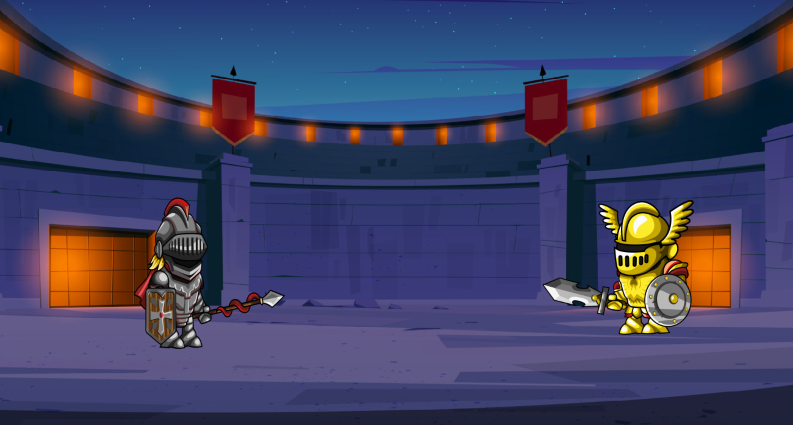
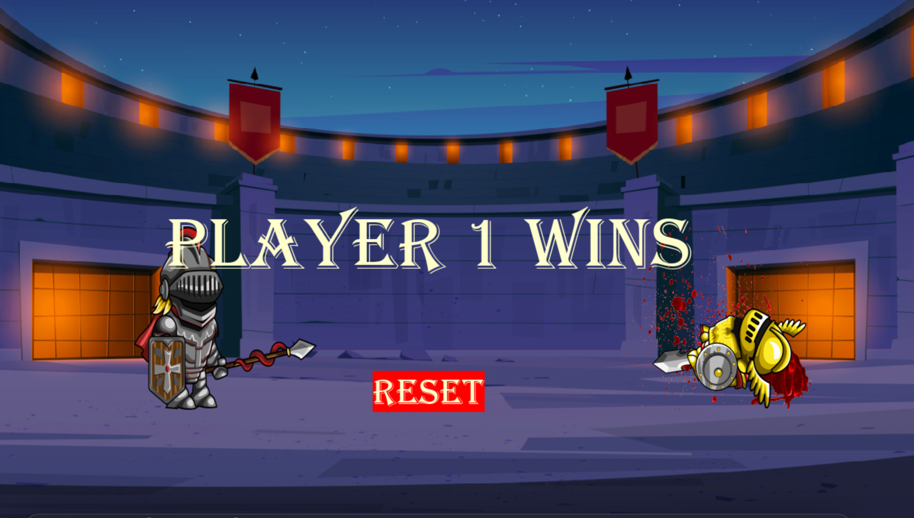

## P02 - Art of War - 2 Player Projectile Game
### Leslie Cook

### Description:
- This is a 2 player projectile battle style game. 

### How to Play:
- Player 1 uses the 'wasd' keys to move the character forward 'd' and backward 'a'. Press 'w' to jump and press 's' to duck.
- Player 1 uses the Right SHIFT key to throw thier weapon at the other player.
- Player 2 uses the arrow keys to move the character forward 'left arrow' and backward 'right arrow'. Press 'up arrow' to jump and press 'down arrow' to duck.
- Player 2 uses the Left SHIFT key to throw thier weapon at the other player.

### Files

|   #   | File              | Description                                        |
| :---: | ----------------- | -------------------------------------------------- |
|   1   | ArtOfWar.py       | The main game driver that handles the game logic.  |
|   3   | PlayerSelection.py| The class for randomized player selection.         |
|   3   | requirements.txt  | File with required libraries to run the game.      |
|   4   | test.py           | Additional file for testing different game logic.  |
|   5   | utilities.py      | Function for handling background music.            |
|   6   | battle_music      | Folder with the music for the game.                |
|   7   | bloodSplat        | Folder with a blood splatter sprite.               |
|   8   | fight_sounds      | Folder with the character animation sounds.        |
|   9   | Projectiles       | Folder with the spites of the players weapons.     |
|   10  | screenshots       | Folder with screenshots of the game.               |
|   11  | Sprites           | Folder with character sprites.                     |

### Instructions

- Make sure to install the required libraries before running the game.
    - `pip install -r requirements.txt`
    - `pip3 install -r requirements.txt`

- Example Command to run the game:
    - `python ArtofWar.py`
    - `python3 ArtofWar.py`

#### Screen Shots:

