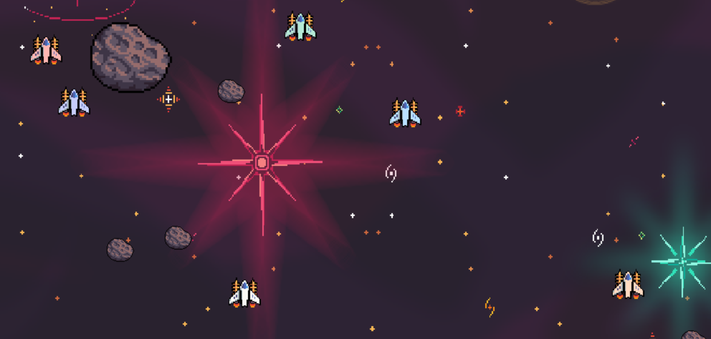
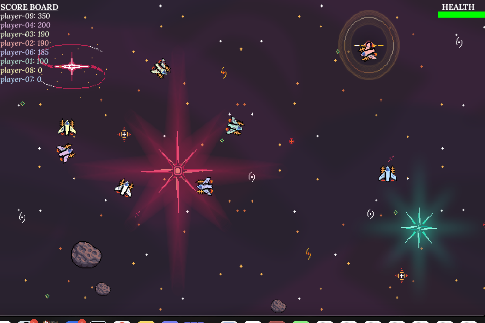

## P03 - Multiplayer Game Asteroids/SpaceBattle
### Leslie Cook
### Description:

- This is a multiplayer game where you can play with up to 10 people. The game is a space battle where you shoot other players to gain points and shoot asteroids to gain extra health. Avoid collisions with ateroids and other players bullets to earn the highest score.

### Files

|   #   | File            | Description                                        |
| :---: | --------------- | -------------------------------------------------- |
|   1   | Asteroid.py     | The class for the asteroids.                       |
|   2   | Background.py   | The class for the Background of the game.          |
|   3   | BaseSprite.py   | The class to process Sprites for the game.         |
|   4   | Bullet.py       | The class for the ships bullets.                   |
|   5   | Comms.py        | The class for communicaitons with RabbitMQ server. |
|   6   | GameDriver.py   | The class that handles all game functionality.     |
|   7   | HealthBar.py    | The class that shows the Health of your ship.      |
|   8   | main.py         | The main driver that launches the game.            |
|   9   | Messenger.py    | The class for message passing.                     |
|   10  | Score.py        | The class that shows score board in the game.      |
|   11  | Ship.py         | The class for the player's ship.                   |
|   12  | Util.py         | The function for scaling sprites in the game.      |
|   13  | Environment     | Folder with the background images used in the game.|
|   13  | Fonts           | Folder with used fonts.                            |
|   14  | Images          | Folder with screenshots of the game.               |
|   15  | Ship            | Folder with sprites used in game.                  |
|   16  | Sounds          | Folder with audio used in game.                    |

### Instructions

- Make sure you install library `pygame.py`

- Example Command:
    - `python main.py game-06 player-09`

#### Screen Shots:

