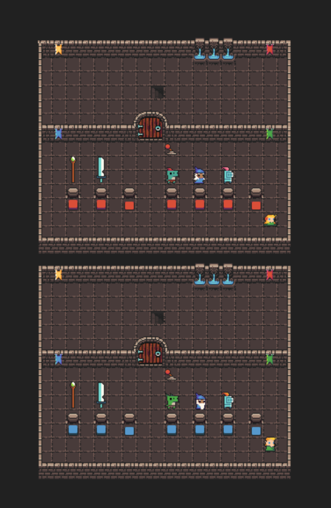
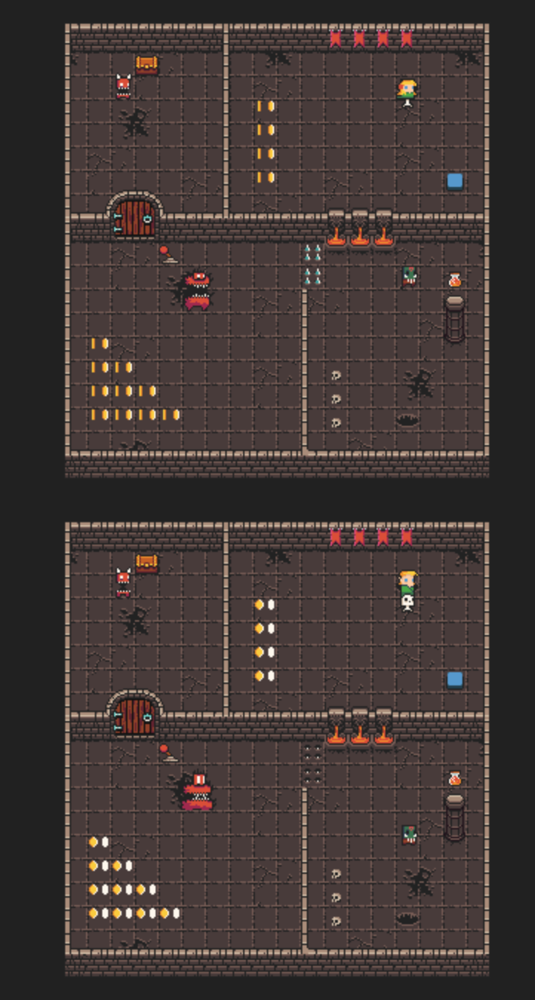
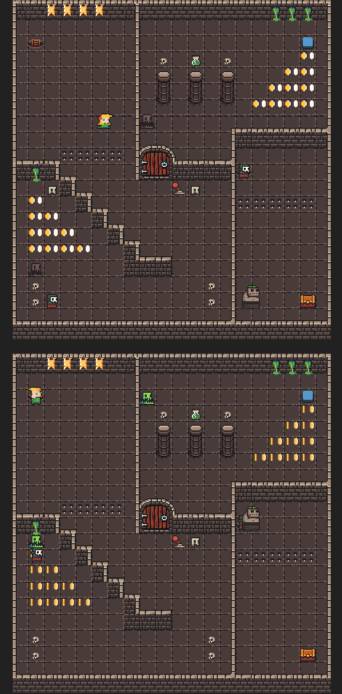
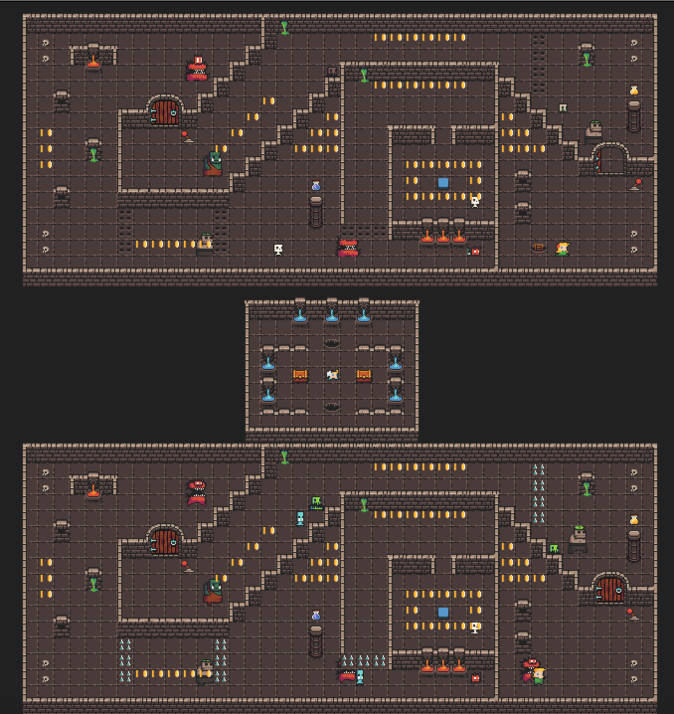
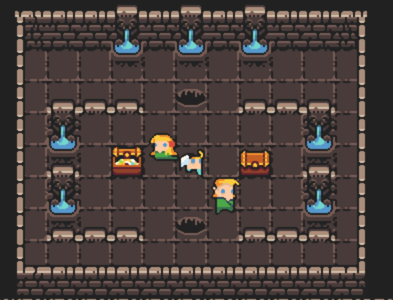
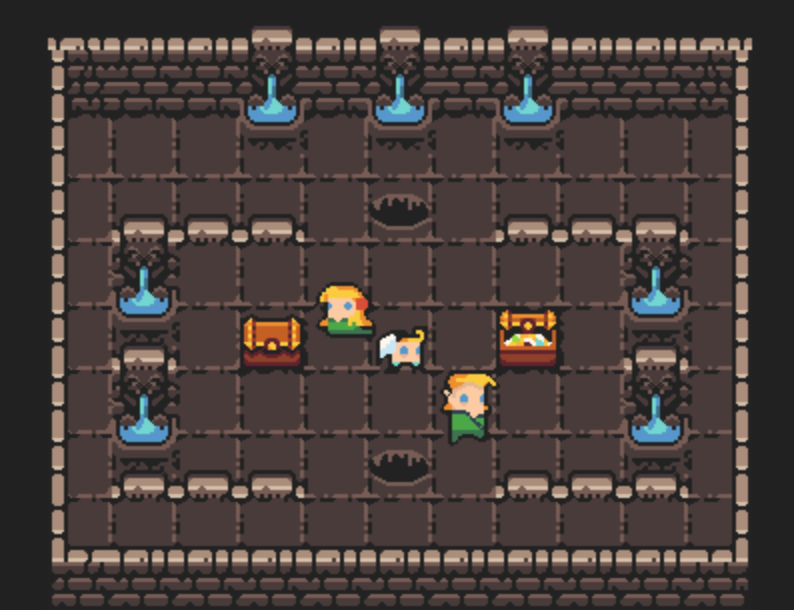

## P04 - Multiplayer Tile Based Game - Dungeon Crawler
### Leslie Cook
### Description:

- The game is a dungeon crawler where the players must defeat enemies and collaborate to portal to different areas in the level and continue to the next level. The game is multiplayer and uses message passing to communicate between the two players. The game uses the tiled map editor to create the levels and the game uses the pytmx library to load the levels into the game. 
The game uses the pygame library to render the game and handle the game logic. It also the pika library to communicate with the RabbitMQ server. 

### How to play:
- Press 'z' to zoom out for a full view of the level.
- Use the arrow keys or 'wasd' keys to move the player around the map.
- To start, walk over the buttons to select different players and weapons.
- Use the space bar to open/close doors and to attack enemies.
- Collect coins and kill enemies to increase your score.
- Collect potions to increase your health.
- In each level, both players must step on the button to portal to a different area. 
- In each level, both players must reach the chest to continue to the next level.
- In the last level, each player opens a treasure chest to win the game. 
- Press 'r' to reset the game at any time.

### Files

|   #   | File            | Description                                        |
| :---: | --------------- | -------------------------------------------------- |
|   1   | Comms.py        | The class for communications with RabbitMQ server. |
|   2   | GameDriver.py   | The class that handles all game functionality.     |
|   3   | Goblin.py       | The class for the NPC animation.                   |
|   4   | GUI.py          | The GUI class for displaying the health and score. |
|   5   | HealthBar.py    | The class that updates the Health of the player.   |
|   6   | LevelOne.py     | The class that handles the logic for level one.    |
|   7   | LevelTwo.py     | The class that handles the logic for level two.    |
|   8   | LevelThree.py   | The class that handles the logic for level three.  |
|   9   | main.py         | The main driver that launches the game.            |
|   10  | Map.py          | The class for loading the tiled map                |
|   11  | Messenger.py    | The class for message passing.                     |
|   12  | Player.py       | The class that handles the players animations.     |
|   14  | requirements.txt| The file to load all requirements to run the game. |
|   13  | Score.py        | The class that updates the players score.          |
|   14  | SpriteSheet.py  | The function for processing sprites in the game.   |
|   15  | StartLevel.py   | The class for starting player selection.           |
|   16  | Tile.py         | The class for the tile properties.                 |
|   17  | Weapon.py       | The class for handling the players weapon.         |
|   18  | Assets          | Folder with Dungeon tile sheet, fonts, and sounds. |
|   19  | Helper          | Folder with started code and resources.            |
|   20  | Levels          | Folder with the tiled .tmx levels used in the game.|

### Instructions

- Make sure you install the requirements.txt before running the game.
    - `pip install -r requirements.txt`
    - `pip3 install -r requirements.txt`

- Example Command to Launch the Game:
    - `python main.py game-06 player-09`
    - `python3 main.py game-06 player-10`

### Screen Shots:

- Start Level

- Level One

- Level Two

- Level Three

- Game Over

